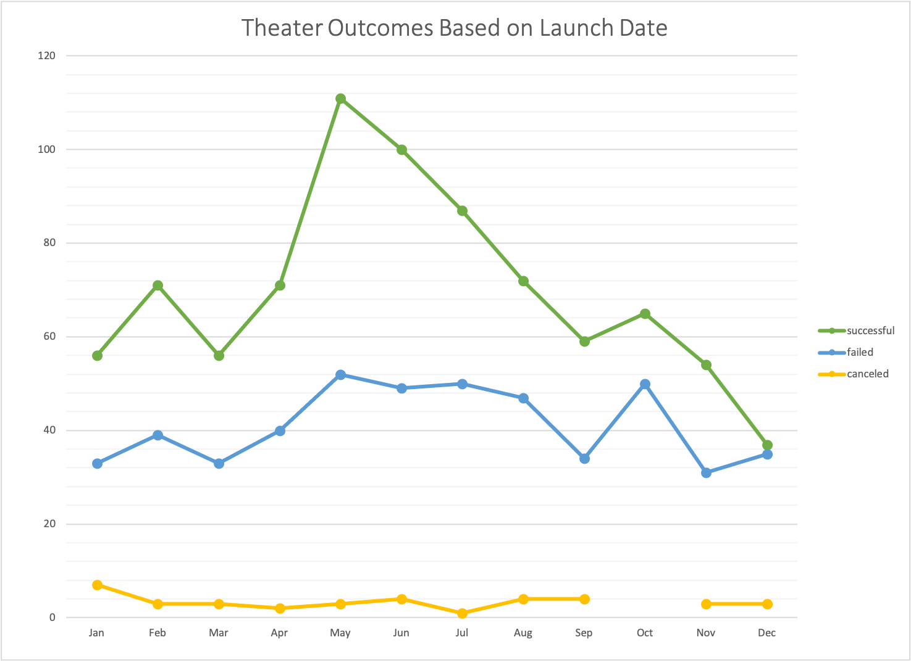
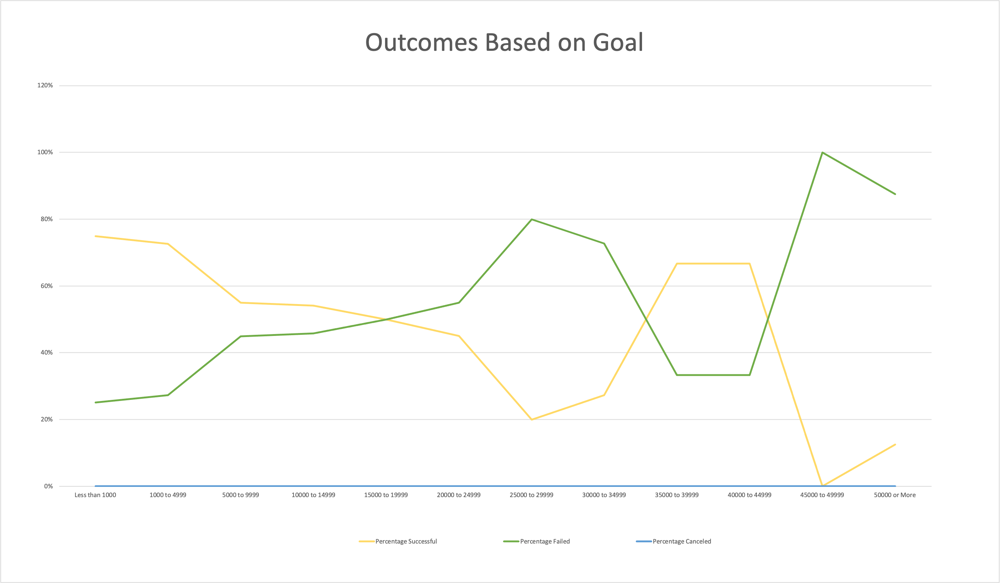

# Kickstarting with Excel

## Overview of Project

Louise has a play called Fever that she has crowdfunded on kickstarter. The campaign came close to reaching it's fundraising goal in a short amount of time. She wants to understand what makes a campaign successful by analyzing launch date and funding goals of other campaigns.  

### Purpose
The purpose of this project is to analyze kickstarter campaign outcomes based on launch date and funding goals. 
With this analysis we can determine what angle to approach Louise's campaign to ensure it reaches it's goal. 

## Analysis and Challenges

### Analysis of Outcomes Based on Launch Date

Using the Data collected, I created a table and graph to visualize the outcomes by Launch date.
Within this table, the data can be filtered by the parent category, along with the year the campaign was launched. 
For example, here you are able to see the comparisons between Successful, Failed, and canceled Theater campaigns vs their launch date. 

### Analysis of Outcomes Based on Goals

Using this same data, I created a visual based on goals. 
The data is separated by the several goal amount ranges, success, failed, canceled outcomes, along with "plays" as a subcategory.
Here is the image created. 

 
### Challenges and Difficulties Encountered

A challenge I found with the outcomes based on goals was filtering the Pivot Tables to ensure data was being portrayed correctly. The solution to this was placing the field names in the correct sections and in the correct order. 

I was also challenged with my line graph on Outcomes based on Goals. I was having trouble building the graph until I used the "Select Data" tool to specify the data and insert each legend one by one. After I completed the graph, I found that my COUNTIFS formulas were written incorrectly. I had forgotten to add the "plays" criteria in my formulas. Once the formula was fixed, my graph was corrected.

## Results

- What are two conclusions you can draw about the Outcomes based on Launch Date?

* When launching Theater campaigns, I found more success to be within the months of May, June, and July. 
Another conclusion I found is a steady decline after the summer months. Leading to about a 50% chance to succeed in December when compared to failed campaigns.

- What can you conclude about the Outcomes based on Goals?

* Based on the data collected here, most successful campaigns fall within the goal of $4999 and below. 
As the goal amount increases, campaigns are generally more likely to fail. According to this data, no campaigns for "plays" have been canceled either.

- What are some limitations of this dataset?

* A limitation of this dataset can be the lack of audience demographic insights. This presents a challenge because different audience demographics can influnce the success of campaigns. For example, plays that are marketed for children could be more successful than plays that are not.  

- What are some other possible tables and/or graphs that we could create?
* A possible visualization would analyze success using the lengths of campaigns by looking at launch dates and deadlines. Another table that shows success based on staff pick and spotlight values could also be useful in this project. 
